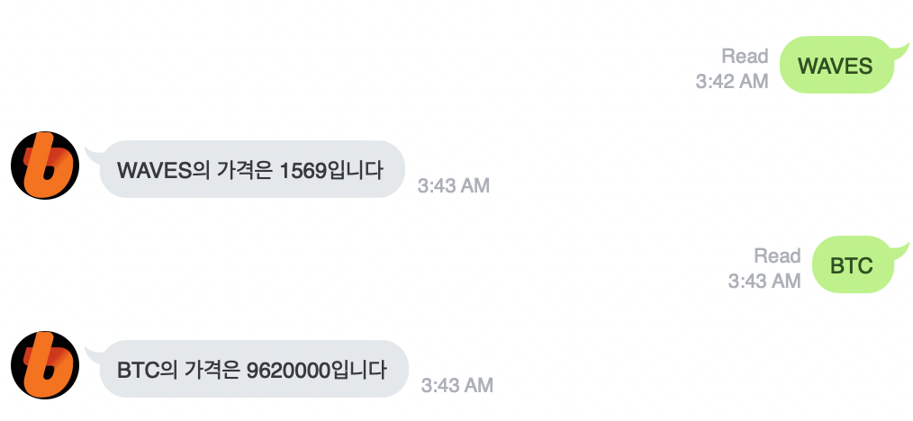

# Line_Bot

Get Coin Price from [빗썸(Bithumb) - 믿을 수 있는 암호화폐 거래소](https://www.bithumb.com) with Line Bot

## 1. Pre
1. **Heroku**
Sign up  [https://www.heroku.com](https://www.heroku.com/) 
2. **Line**
Sign up [LINE Developers](https://developers.line.biz/en/)
Add Provider
Use MessagingAPI (Create Channel)
	- Use **Channel secret** / **Channel access token (long-lived)**
	- **Use Webhooks** Enable
	- **Webhook URL** : https://{heruku app name}.herukherokuapp.com/callback


## 2. Install Heroku cli
**mac**
```
brew tap heroku/brew && brew install heroku
```
**ubuntu**
```shell
curl https://cli-assets.heroku.com/install.sh | sh
```
**check_version**
```shell
heroku —version
#heroku/7.30.1 darwin-x64 node-v11.14.0
```

## 3. Script

```shell
heroku login -i
heroku create linebotij --buildpack heroku/python
heroku git:remote -a lazyerij
git clone https://github.com/LazyerIJ/Bithumb_Line_Bot
```
vi app.py
fix secret / access token

```shell
git add .
git commit -m "app"
git push heroku master
heroku logs --tail
```

- - - -


# Result





# Bug report

**fail to detect**
[Buildpacks | Heroku Dev Center](https://devcenter.heroku.com/articles/buildpacks)
```shell
#create
heroku create linebotij --buildpack heroku/python
#or set exist repo
heroku buildpacks:cleart
heroku buildpacks:set heroku/python
```

**commit rejected**
```shell
echo web: python app.py > Profiel
echo python-3.7.0 > runtime.txt
touch setup.py
pip freeze > requirements.txt
```

**H10 - App crashed**
[Heroku Error Codes | Heroku Dev Center](https://devcenter.heroku.com/articles/error-codes#h10-app-crashed)
maybe code error
```shell
heroku restart
```

**R10 (Boot timeout )**
[Heroku Error Codes | Heroku Dev Center](https://devcenter.heroku.com/articles/error-codes#h20-app-boot-timeout)
```python
port = int(os.getenv(“PORT”))
app.run(host=“0.0.0.0”, port=port)
```

**Couldn’t find that process type (web)”**
```shell
$ heroku ps:scale web=1
```


